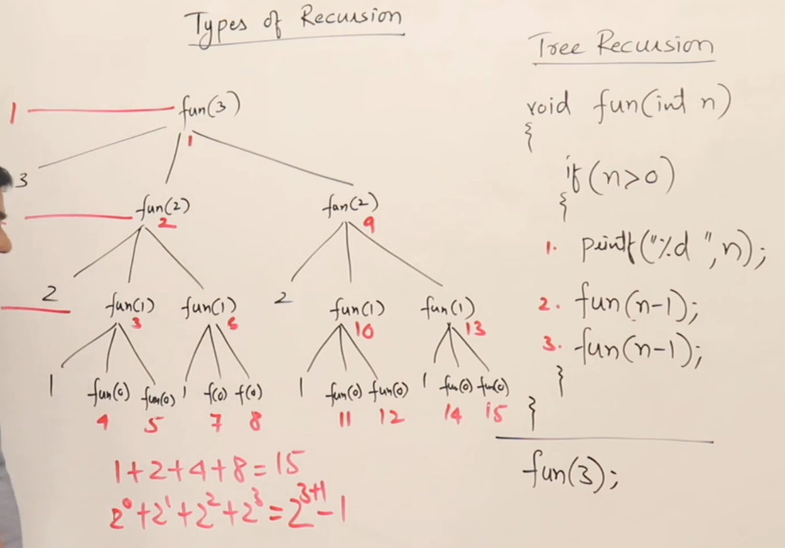
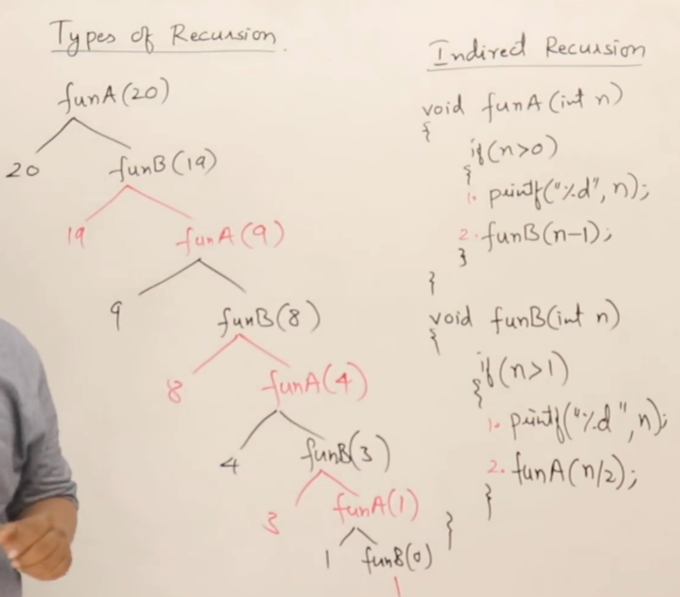
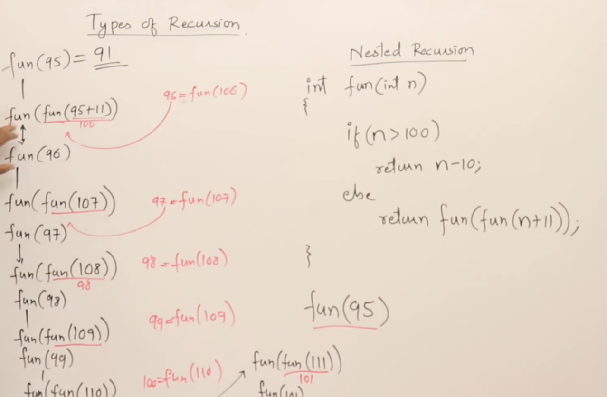

# Types of Recusrion

1. [Tail Recursion](#tail-recursion)
2. [Head Recursion](#head-recursion)
3. [Tree Recursion](#tree-recursion)
4. [Indirect Recursion](#indirect-recursion)
5. [Nested Recursion](#nested-recursion)

# Tail Recursion

If a recursive function is calling itself and that call is the last statement in the recursion and after it is nothing. Everything is performed at calling time itself.

## Recursive Code

TC: O(n); SC: O(n)

Space complexity is due to the activation record in the stack segment of main memory for the function calls due to recursion.

```cpp
void fun(int n){
    if(n > 0){ // base condition
        cout << n << endl; // calling phase operation
        fun(n - 1); // only this recursive call at the end
        // and not like this return fun() + n meaning there should
        // be nothing in the returning phase
        // all operations in the calling phase
    }
}
```

## Using Loops

TC: O(n); SC: O(1)

```cpp
void fun(int n){
        while(n > 0){
        n --;
    }
}
```

# Head Recursion

The function doesn't have to perform anything at the time of calling, all operations are done at the time of returning.
Can't be easily converted to a loop, but can be converted.

## Recursive Code

TC: O(n); SC: O(n)

```cpp
void fun(int n){
    if(n > 0){
        fun(n - 1);
        cout << n << endl;
    }
}
```

## Using Loops

TC: O(n); SC: O(1)

```cpp
void fun(int n){
    int i = 0;

    while (i <=n){
        cout << n << endl;
        i++;
    }
}
```

# Tree Recursion

When there are multiple function calls within the recursive function.
For two calls



Can be written as
2^n+1 - 1 = O(2^n)

So,

- TC: O(2^n)
- SC: O(n+1) = O(n)

Depends on the function, what time complexity we will be getting.

# Indirect Recursion



# Nested Recursion
Recursive call itself takes recursive call as parameter.

