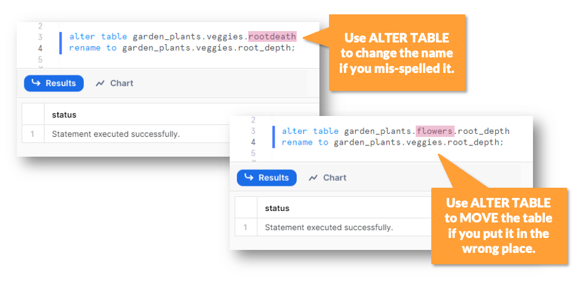

The `ALTER` command in Snowflake is used to modify existing database objects such as **databases, schemas, tables, views, users, roles, warehouses,** and more. Below is a detailed breakdown of different `ALTER` commands and their usage.

---

## **1. ALTER DATABASE**

Used to modify a database.

### **Syntax:**

```sql
ALTER DATABASE database_name SET DATA_RETENTION_TIME_IN_DAYS = 30;
ALTER DATABASE database_name RENAME TO new_database_name;
ALTER DATABASE database_name SUSPEND;
ALTER DATABASE database_name RESUME;
DROP DATABASE database_name;
```

### **Key Operations:**

- Change database properties (`SET DATA_RETENTION_TIME_IN_DAYS`).
- Rename a database (`RENAME TO`).
- Suspend/resume a database.

---

## **2. ALTER SCHEMA**

Used to modify a schema.

### **Syntax:**

```sql
ALTER SCHEMA schema_name RENAME TO new_schema_name;
ALTER SCHEMA schema_name SET COMMENT = 'This is a test schema';
DROP SCHEMA schema_name;
```

### **Key Operations:**

- Rename a schema.
- Add a comment to a schema.

---

## **3. ALTER TABLE**

Used to modify tables, such as adding/removing columns, renaming columns, and changing constraints.

### **Syntax:**

```sql
ALTER TABLE table_name ADD COLUMN new_column_name STRING;
ALTER TABLE table_name DROP COLUMN column_name;
ALTER TABLE table_name RENAME COLUMN old_column_name TO new_column_name;
ALTER TABLE table_name MODIFY COLUMN column_name SET DATA TYPE INT;
ALTER TABLE table_name SET COMMENT = 'This is a sample table';
```

### **Key Operations:**

- Add, drop, rename, or modify columns.
- Change column data type.
- Add comments.

---

## **4. ALTER VIEW**

Used to modify a view.

### **Syntax:**

```sql
ALTER VIEW view_name RENAME TO new_view_name;
ALTER VIEW view_name SET COMMENT = 'This is a sample view';
```

### **Key Operations:**

- Rename a view.
- Add a comment to a view.

---

## **5. ALTER USER**

Used to modify user settings.

### **Syntax:**

```sql
ALTER USER username SET PASSWORD = 'NewPassword123';
ALTER USER username SET DEFAULT_ROLE = role_name;
ALTER USER username SET COMMENT = 'This is a test user';
```

### **Key Operations:**

- Change user password.
- Set default role.
- Add a comment.

---

## **6. ALTER ROLE**

Used to modify roles.

### **Syntax:**

```sql
ALTER ROLE role_name RENAME TO new_role_name;
ALTER ROLE role_name SET COMMENT = 'This is a test role';
```

### **Key Operations:**

- Rename a role.
- Add a comment to a role.

---

## **7. ALTER WAREHOUSE**

Used to modify warehouses.

### **Syntax:**

```sql
ALTER WAREHOUSE warehouse_name SET WAREHOUSE_SIZE = 'LARGE';
ALTER WAREHOUSE warehouse_name SUSPEND;
ALTER WAREHOUSE warehouse_name RESUME;
```

### **Key Operations:**

- Resize a warehouse.
- Suspend or resume a warehouse.

---

## **8. ALTER STORAGE INTEGRATION**

Used to modify external storage integrations (e.g., AWS S3, Azure Blob Storage).

### **Syntax:**

```sql
ALTER STORAGE INTEGRATION integration_name SET STORAGE_ALLOWED_LOCATIONS = ('s3://new-bucket/');
```

### **Key Operations:**

- Change storage integration settings.

---

## **9. ALTER PIPE**

Used to modify Snowpipe settings.

### **Syntax:**

```sql
ALTER PIPE pipe_name SET COMMENT = 'Updated pipe';
ALTER PIPE pipe_name REFRESH;
```

### **Key Operations:**

- Add a comment.
- Refresh Snowpipe.

---

## **10. ALTER STREAM**

Used to modify streams.

### **Syntax:**

```sql
ALTER STREAM stream_name SET COMMENT = 'Stream for tracking changes';
```

### **Key Operations:**

- Add a comment.

---

## **Summary Table**

| Object                  | Common `ALTER` Operations                         |
| ----------------------- | ------------------------------------------------- |
| **DATABASE**            | Rename, suspend, resume, retention settings       |
| **SCHEMA**              | Rename, comment                                   |
| **TABLE**               | Add/drop/rename column, modify data type, comment |
| **VIEW**                | Rename, comment                                   |
| **USER**                | Change password, default role, comment            |
| **ROLE**                | Rename, comment                                   |
| **WAREHOUSE**           | Resize, suspend, resume                           |
| **STORAGE INTEGRATION** | Modify storage locations                          |
| **PIPE**                | Comment, refresh                                  |
| **STREAM**              | Comment                                           |

# Other Commands

