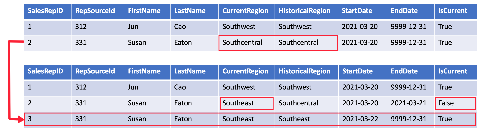

# Introduction

Slowly Changing Dimensions (SCD) are a critical concept in data warehousing, specifically for managing and tracking changes in dimension data over time. They help in maintaining historical accuracy in reports and analyses.

# Understanding Different Types of SCD

Star schema design theory refers to common SCD types. The most common are Type 1 and Type 2. In practice a dimension table may support a combination of history tracking methods, including Type 3 and Type 6. Let's get to know the difference in these SCD types.

## SCD Type 1 (UPSERT = INSERT + UPDATE)

Using SCD type 1, if a record in a dimension table changes, the existing record is updated or overwritten. Otherwise, the new record is inserted into the dimension table. This means records in the dimension table always reflect the current state and no historical data is maintained.

In the data engineering world, this practice of updating data if it exists or inserting it otherwise is known as “upserting.” The table below contains information about items sold in a grocery store.

**Initial Data:**

| customer_id | name     | address       | phone_number |
| ----------- | -------- | ------------- | ------------ |
| 001         | John Doe | 123 Maple St. | 555-1234     |

John moves to a new address. In **Type 1 SCD**, the old data is **overwritten**, and no history is kept. This is used when tracking historical changes isn't necessary.

**After Update (Type 1 SCD):**

| customer_id | name     | address     | phone_number |
| ----------- | -------- | ----------- | ------------ |
| 001         | John Doe | 789 Oak St. | 555-1234     |

Here, the address was updated directly, and the previous address ("123 Maple St.") is no longer available in the data warehouse.

Type 1 SCD is best when you don’t need to maintain historical data, and accuracy of the current state is more important.

## SCD Type 2

While having a table that reflects only the current state may be useful, there are times when it’s convenient, and even essential, to track historical changes to a dimension. With SCD type 2, **historical data is maintained** by adding a new row when a dimension changes and properly denoting this new row as current while denoting the newly historical record accordingly.

Sure! Here’s an example for **Type 2 Slowly Changing Dimensions (SCD)** in data warehousing, where we keep **historical data** by creating a new record for each change:

**Initial Data:**
| customer_id | name | address | phone_number | start_date | end_date |
|-------------|---------|----------------|--------------|------------|-----------|
| 001 | John Doe| 123 Maple St. | 555-1234 | 2022-01-01 | NULL |

John moves to a new address. In **Type 2 SCD**, the old record is kept, and a new record is inserted with the updated address and the appropriate date range.

**After Update (Type 2 SCD):**
| customer_id | name | address | phone_number | start_date | end_date |
|-------------|---------|----------------|--------------|------------|-----------|
| 001 | John Doe| 123 Maple St. | 555-1234 | 2022-01-01 | 2024-09-01|
| 002 | John Doe| 789 Oak St. | 555-1234 | 2024-09-02 | NULL |

In Type 2 SCD, historical changes are preserved, allowing you to track past addresses while keeping the current data.

## SCD Type 3

When working with data that is only expected to change once, or only the most recent historical record is of interest, SCD type 3 is quite useful. Rather than “upserting” an altered dimension or storing the change as a new row, SCD type 3 uses a column to represent the change.

Here's an example of **Type 3 Slowly Changing Dimensions (SCD)** in data warehousing, where we track **limited history** by adding new columns for storing previous values, usually only the last change.

Initial Data:
| customer_id | name | current_address | previous_address | change_date |
|-------------|---------|-----------------|------------------|-------------|
| 001 | John Doe| 123 Maple St. | NULL | NULL |

John moves to a new address. In **Type 3 SCD**, we update the current address and move the old address to a **previous_address** field, keeping track of only the most recent change.

After Update (Type 3 SCD):
| customer_id | name | current_address | previous_address | change_date |
|-------------|---------|-----------------|------------------|-------------|
| 001 | John Doe| 789 Oak St. | 123 Maple St. | 2024-09-02 |

- **current_address**: The new address (789 Oak St.) is stored.
- **previous_address**: The old address (123 Maple St.) is kept in a separate column.
- **change_date**: The date when the change occurred is stored.

In Type 3 SCD, only **limited history** is tracked—typically just the previous value—making it useful when you only need to remember the last change.

## SCD Type 6 (Hybrid SCD)

Type 6 SCD, also known as **Hybrid SCD** (or SCD Type 6), combines features of **Type 1**, **Type 2**, and **Type 3** to track both current, historical, and limited previous data. It typically includes additional columns for current value, historical changes, and the previous value of attributes.

**Initial Data:**
| customer_id | name | current_address | previous_address | start_date | end_date | version |
|-------------|---------|-----------------|------------------|------------|------------|---------|
| 001 | John Doe| 123 Maple St. | NULL | 2022-01-01 | NULL | 1 |

#### Scenario:

John moves to a new address. In **Type 6 SCD**, we:

- **Overwrite the current value** (Type 1).
- **Add a new record** for the new value (Type 2).
- **Track the previous value** in a separate column (Type 3).

**After Update (Type 6 SCD):**
| customer_id | name | current_address | previous_address | start_date | end_date | version |
|-------------|---------|-----------------|------------------|-------------|------------|---------|
| 001 | John Doe| 789 Oak St. | 123 Maple St. | 2024-09-02 | NULL | 2 |
| 001 | John Doe| 123 Maple St. | NULL | 2022-01-01 | 2024-09-01 | 1 |

- **current_address**: Now contains John’s latest address (789 Oak St.).
- **previous_address**: Stores the old address (123 Maple St.).
- **start_date / end_date**: Shows the valid period for each record.
- **version**: Tracks the version of the record, with each change incrementing the version.

### Breakdown:

- **Type 1 (Overwrite)**: The **current_address** is overwritten with the new address.
- **Type 2 (Historical Tracking)**: The old record is kept with a start and end date.
- **Type 3 (Previous Value)**: The **previous_address** is maintained in a separate column for limited history.

Type 6 SCD provides a comprehensive way to track both **current, past, and recent changes** efficiently.

