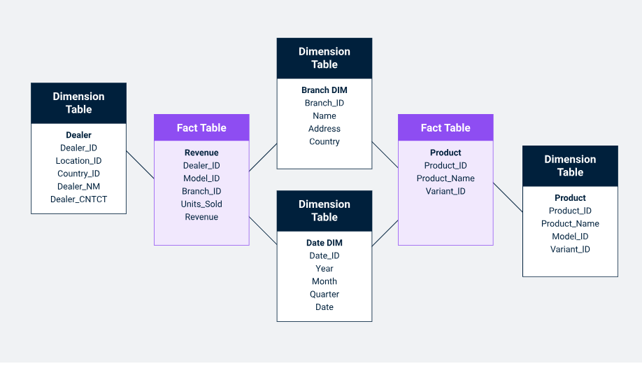

# Introduction

The Galaxy Data Warehouse Schema , also known as a **Fact Constellation Schema**, acts as the next iteration of the data warehouse schema. Unlike the Star Schema and Snowflake Schema, the Galaxy Schema uses multiple fact tables connected with shared normalized dimension tables. Galaxy Schema can be thought of as star schema interlinked and completely normalized, avoiding any kind of redundancy or inconsistency of data.

# Example Use Case: Retail Data Warehouse
A retail company that wants to analyze both sales and inventory data can use a galaxy schema to link multiple business processes in the same schema.

## Fact Table 1: Sales_Fact

Fields: Order_ID, Date_ID, Product_ID, Customer_ID, Revenue, Quantity_Sold.
## Fact Table 2: Inventory_Fact

Fields: Warehouse_ID, Product_ID, Date_ID, Stock_Level, Restock_Quantity.

## Dimension Tables:

- Product Dimension: Shared by both fact tables to describe product attributes.
    - Fields: Product_ID, Product_Name, Category, Brand, Unit_Price.
- Date Dimension: Shared by both fact tables to analyze sales and inventory over time.
    - Fields: Date_ID, Year, Month, Day, Weekday.
- Customer Dimension: Used by the sales fact table to provide customer details.
    - Fields: Customer_ID, Customer_Name, Region, Age, Gender.
- Warehouse Dimension: Used by the inventory fact table to track inventory locations.
    - Fields: Warehouse_ID, Warehouse_Name, Location, Manager_Name.

# Advantages of Galaxy Schema
- **Handling Multiple Business Processes:** The galaxy schema is ideal for data warehouses that need to handle multiple, related business processes. For instance, it can support sales, marketing, and inventory processes within the same schema by creating multiple fact tables.

- **Data Consistency Through Shared Dimensions:**
By using shared dimensions, the schema ensures data consistency across different fact tables. For example, product details are stored once and referenced by multiple fact tables, which avoids redundancy and inconsistency in the data.
- **Supports Complex Analytical Queries:** A galaxy schema is designed to handle complex analytical queries involving multiple fact tables. For example, a business might want to analyze how inventory levels impact sales performance, and this can be done efficiently using a galaxy schema.
- **Scalability:** The schema design is scalable and can easily be extended to accommodate new business processes or fact tables without disrupting the overall structure. New fact tables can be added as needed, and existing dimensions can be reused or extended.
- **Improved Query Performance:** By normalizing dimension tables (like in a snowflake schema) and using shared dimensions, query performance can be optimized, especially in large data warehouses where data volume is a concern.
# Disadvantages of Galaxy Schema
- **Increased Complexity:** The biggest drawback of a galaxy schema is its complexity. Managing multiple fact tables and ensuring correct joins between fact and dimension tables can become challenging, especially as the number of fact tables grows.
- **More Complex Queries:** Querying a galaxy schema can require more complex SQL statements due to the need to join multiple fact tables and dimensions. Users may need specialized knowledge of the schema to write effective queries.
- **Slower Query Performance (in some cases):** While the galaxy schema can optimize query performance, the added complexity of multiple fact tables and the need for more joins may lead to slower performance in certain queries, especially when compared to a simpler star schema.
- **Maintenance Overhead:** With multiple fact tables and shared dimensions, maintaining the galaxy schema can require more effort, especially when updating or modifying the schema structure. Data consistency and integrity across multiple fact tables need careful management.
