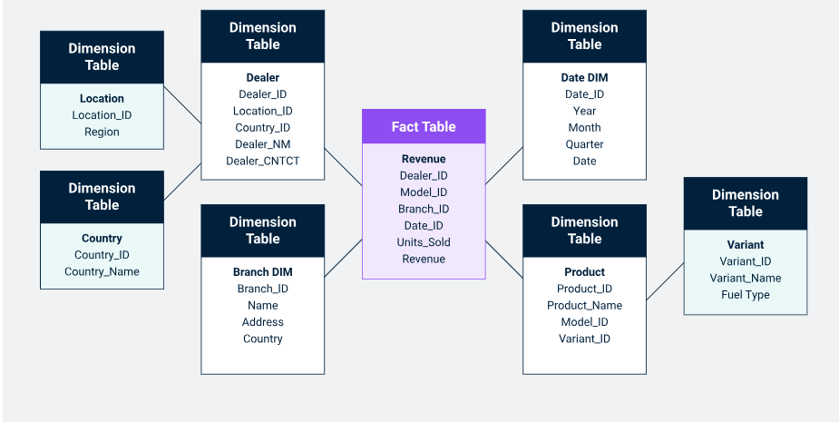

# Introduction

A snowflake schema is an extension of the star schema commonly used in data warehousing and business intelligence applications. Like the star schema, it is used to organize data for efficient querying and reporting. The main difference between the two is that the snowflake schema further normalizes the dimension tables by splitting them into additional related tables, creating a structure that resembles a snowflake.

While a star schema keeps its dimension tables denormalized (flattened), a snowflake schema attempts to reduce redundancy by organizing data into multiple related tables, leading to a more normalized structure.

# Advantages of Snowflake Schema
- **Reduction of Data Redundancy:** By normalizing dimension tables, the snowflake schema reduces redundancy. Data is stored more efficiently, especially when dealing with large volumes of data. For example, instead of repeating the Category or Brand attributes for each product, they are stored separately and referenced through foreign keys.

- **Improved Data Integrity:** The normalization process enforces data integrity by eliminating data duplication. This minimizes the risk of inconsistencies and anomalies in the data warehouse. For instance, if a product’s category name needs to be updated, the change only needs to be made once in the Category table.
- **Better Representation of Hierarchical Data:** Snowflake schemas are ideal for representing hierarchical relationships in dimensions. For example, if a Geography Dimension needs to be analyzed by country, state, and city, these hierarchical relationships are well-captured in the snowflake structure.
- **More Structured Data:** The additional structure and normalization make the schema more maintainable and easier to scale as the database grows. It also makes adding new attributes or dimensions simpler, as they can be normalized into related tables.

# Disadvantages of Snowflake Schema

- **Complexity in Querying:** One of the biggest drawbacks of a snowflake schema is that it makes queries more complex. Since the dimension tables are normalized, you often need to join multiple tables to retrieve the desired data, increasing the time and complexity of writing and optimizing queries.
- **Slower Performance:** The additional joins between tables in a snowflake schema can lead to slower query performance, especially for complex queries that require retrieving data from several dimension tables. Performance optimization techniques like indexing are often necessary.
- **Increased Joins:** Because the snowflake schema involves more tables due to normalization, queries require more joins. This not only adds complexity to queries but can also degrade performance if the database is not optimized or indexed properly.
- **More Difficult to Understand:** For end-users or report writers who are not familiar with normalized schemas, the snowflake schema can be harder to understand and navigate compared to a simpler star schema. The multiple layers of tables can create confusion, especially when building reports or dashboards.

