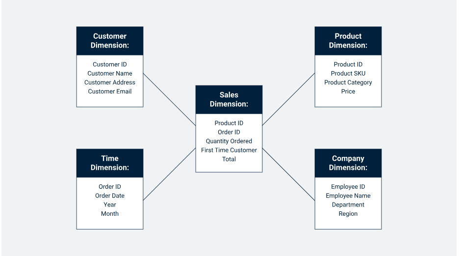

# Introduction

A star schema is a type of database schema used in data warehousing and business intelligence to organize and structure data for efficient querying and reporting. It’s called a "star schema" because the diagram of the schema resembles a star shape, where a central **fact table** is connected to multiple **dimension tables** radiating outwards like the points of a star. It is one of the simplest and most common types of schemas used for designing relational data warehouses.

# Components of a Star Schema

## Fact Table:

The fact table is the central table in the schema. It contains quantitative data or facts that are subject to analysis, such as sales figures, revenue, or inventory levels.
These facts are usually numerical and can be aggregated, such as totals, averages, or counts.
It also contains foreign keys that link to the dimension tables, which describe the "context" of the facts.

Examples of columns in a fact table:
Sales Fact Table: Order ID, Date ID, Product ID, Customer ID, Quantity Sold, Total Revenue.

## Dimension Tables:

Dimension tables surround the fact table and provide descriptive, textual information related to the facts in the fact table. Each dimension table represents one business entity or context.
The dimension tables help to slice and dice the facts in different ways, such as by time, geography, product, or customer.
Each dimension table contains a primary key (often a surrogate key) and various attributes that describe the entity.

Examples of dimension tables:
- Product Dimension Table: Product ID, Product Name, Category, Brand, Price.
- Customer Dimension Table: Customer ID, Customer Name, Region, Age, Gender.
- Date Dimension Table: Date ID, Year, Month, Day, Weekday.

## Primary Key and Foreign Key Relationships:

In the star schema, the fact table has foreign keys that reference the primary keys in the dimension tables. This relationship allows for efficient joins between the fact and dimension tables during querying.

# Advantages of Star Schema

**Simplicity:** The star schema is straightforward and easy to understand, making it an ideal design for end-users who are using reporting tools or querying the data warehouse.

**Efficient Querying:** The star schema supports efficient queries because it minimizes the number of joins between tables. Queries often involve joining the fact table with one or more dimension tables, which are usually smaller and indexed.

**Denormalized Dimension Tables:** The dimension tables are typically denormalized (flattened) for better performance, allowing users to get data quickly without needing to navigate through many tables.

**Fast Aggregation:** Aggregation operations (e.g., summing revenue, counting orders) are quick and optimized, as facts are pre-aggregated and dimension attributes provide context without needing complex joins.

**Optimized for OLAP (Online Analytical Processing):** Star schemas are ideal for OLAP systems, where users are interested in analyzing data from multiple perspectives (e.g., sales by region, sales by product, etc.).

# Disadvantages of Star Schema

**Data Redundancy:** Because the dimension tables are denormalized, there can be some duplication of data (e.g., product details might be repeated if multiple transactions include the same product). This leads to some inefficiencies in storage.

**Less Flexibility for Complex Relationships:** A star schema does not handle complex relationships well, such as many-to-many relationships between dimensions. For such cases, a more normalized schema (e.g., a snowflake schema) might be required.

**Maintenance Overhead:** If a dimension table needs frequent updates, the maintenance of denormalized data in the star schema can become complex.