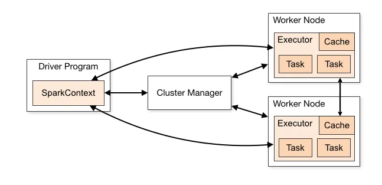

# What is pySpark ?

PySpark is the Python API for Apache Spark, an open-source distributed computing framework designed for big data processing and analytics. It allows you to use Python to write Spark applications, leveraging the power of distributed computing for handling massive datasets efficiently.

# Key Features of PySpark:

1. Distributed Computing – PySpark distributes data across multiple nodes, enabling fast parallel processing.
2. High-Level APIs – Provides easy-to-use APIs for working with large datasets, such as RDDs (Resilient Distributed Datasets), DataFrames, and Datasets.
3. Integration with Big Data Tools – Works seamlessly with Hadoop, Hive, HDFS, Kafka, and other big data tools.
4. ML & AI Support – Comes with MLlib, a machine learning library for scalable ML models.
5. SQL Queries – Supports Spark SQL, allowing you to run SQL-like queries on distributed data.
6. Stream Processing – Supports real-time data processing using Structured Streaming.

# Architecture

The Apache Spark framework uses a master-slave architecture that consists of a driver, which runs as a master node, and many executors that run across as worker nodes in the cluster. Apache Spark can be used for batch processing and real-time processing as well.

# The Spark driver

The driver is the program or process responsible for coordinating the execution of the Spark application. It runs the main function and creates the SparkContext, which connects to the cluster manager.

# The Spark executors

Executors are worker processes responsible for executing tasks in Spark applications. They are launched on worker nodes and communicate with the driver program and cluster manager. Executors run tasks concurrently and store data in memory or disk for caching and intermediate storage.

# The cluster manager

The cluster manager is responsible for allocating resources and managing the cluster on which the Spark application runs. Spark supports various cluster managers like Apache Mesos, Hadoop YARN, and **standalone cluster manager**.

The standalone cluster manager is the default cluster manager.
